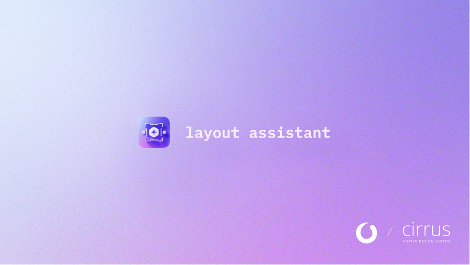
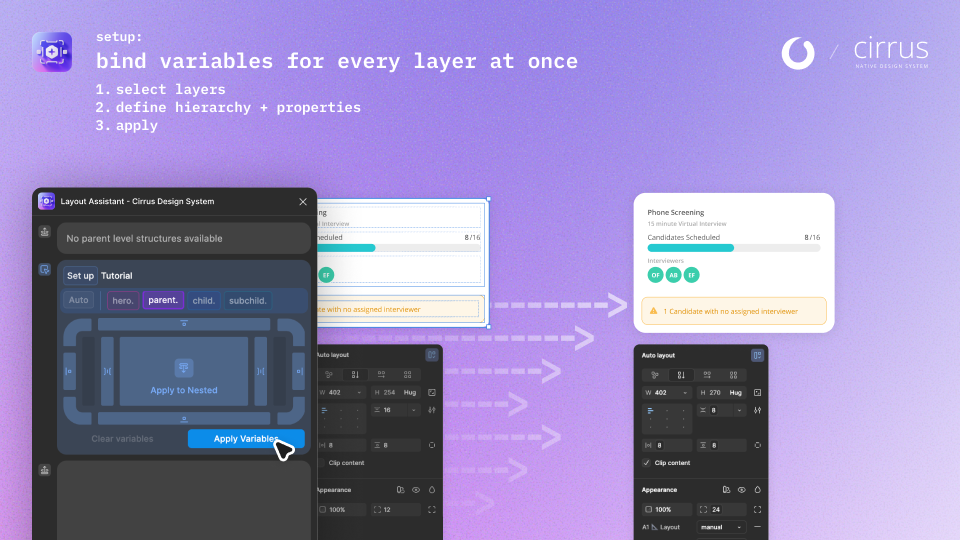
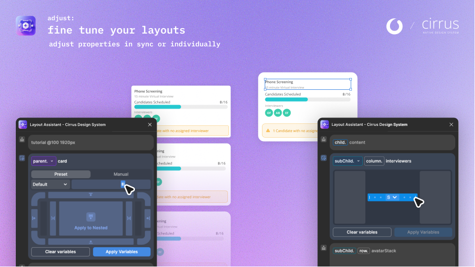

# Layout Assistant - Cirrus Design System

A Figma plugin that automatically applies layout variables from the Cirrus Design System to frames with auto-layout, streamlining your design workflow with intelligent prefix detection and batch processing.

<div align="center">
  
</div>

<table>
<tr>
<td width="50%">
  
</td>
<td width="50%">
  
</td>
</tr>
</table>

## Overview

**Layout Assistant** automates the application of design tokens (spacing, padding, corner radius) to Figma frames based on their naming conventions. Instead of manually binding variables to each frame, you can batch-apply layout tokens across entire component hierarchies with a single click.

### Why Use It?

- **Save Time**: Apply layout tokens to multiple frames and nested children simultaneously
- **Consistency**: Ensures all frames use the correct design system variables
- **Intelligent**: Automatically detects frame hierarchy and applies appropriate variable modes
- **Flexible**: Works with prefixed frames or helps set up new frames with Setup Mode

### When to Use It?

- Setting up new components with layout tokens
- Applying design system updates across existing components
- Ensuring consistency in component libraries
- Batch processing multiple frames with auto-layout

### How It Works

1. **Frame Naming**: Frames are named with prefixes (`parent.*`, `child.*`, `subChild.*`, `hero.*`) that indicate their hierarchy level
2. **Variable Application**: The plugin finds matching frames and applies layout variables (`spacing`, `padding`, `corner-radius`) from the Cirrus Design System
3. **Mode Setting**: Automatically sets variable modes based on the frame's prefix, ensuring correct token values for each hierarchy level
4. **Batch Processing**: Recursively processes nested frames, applying tokens throughout the component structure

### Basic Concepts

- **Layout Collection**: Contains the actual variable values (`spacing`, `padding`, `corner-radius`) bound to frame properties
- **Master Collections**: Control modes for manual adjustment in Figma's UI (A1-A4 collections)
- **Primitive Collections**: Used for hierarchy-based mode setting based on frame prefixes
- **Prefix Hierarchy**: `parent.*` → `child.*` → `subChild.*` determines which variable modes are applied

## Quick Start

### Prerequisites

- Figma file with the **"Cirrus - Native Design System"** team library enabled
- Library must contain the **"A1 📐 Layout"** collection with `spacing`, `padding`, and `corner-radius` variables

### Installation

1. Clone and build:
   ```bash
   git clone https://github.com/Widoba/layout-assistant-cirrus-design-system.git
   cd layout-assistant-cirrus-design-system
   npm install
   npm run build
   ```

2. Import in Figma:
   - Go to **Plugins → Development → Import plugin from manifest**
   - Select the `manifest.json` file

### Basic Usage

1. Name frames with allowed prefixes:
   - `parent.header`, `parent.main`
   - `child.card`, `child.section`
   - `subChild.button`, `subChild.text`
   - `hero.banner`, `hero.cta`

2. Select frames and run the plugin

3. Click **"Apply Variables"** to batch-apply layout tokens

### Setup Mode

For frames without prefixes, Setup Mode automatically activates:
- Select unprefixed frames
- Choose a prefix from the dropdown (or use "Auto" for automatic detection)
- Apply variables to rename and set tokens in one step

## Features

- **Automatic Variable Application**: Applies spacing, padding, and corner-radius variables from the A1 📐 Layout collection
- **Intelligent Mode Detection**: Sets variable modes based on frame name prefixes
- **Setup Mode**: Helps set up new frames with guided prefix selection
- **Batch Processing**: Recursively applies tokens to nested frames
- **Resizable Window**: Customize plugin window size to fit your workflow
- **Responsive UI**: Adapts layout based on window width

## Collection Architecture

The plugin uses a multi-collection architecture:

- **Layout Collection (A1 📐 Layout)**: Contains variable values bound to frame properties
- **Master Collections (A1-A4)**: Control modes for manual adjustment in Figma UI
- **Primitive Collections**: Used for hierarchy-based mode setting

See [RELEASE_NOTES.md](RELEASE_NOTES.md) for version history and detailed changes.

## Development

### Quick Start

```bash
npm install          # Install dependencies
npm run build       # Build for production
npm run dev         # Development mode with watch
```

### Project Structure

```
├── src/
│   ├── code.ts          # Main plugin logic
│   ├── ui.html          # Plugin UI interface
│   └── assets/          # Icons and images
├── dist/                # Build output (not tracked)
├── doc/                 # Documentation
└── manifest.json        # Plugin configuration
```

## Contributing

Contributions are welcome! Please feel free to submit a Pull Request.

## License

ISC
